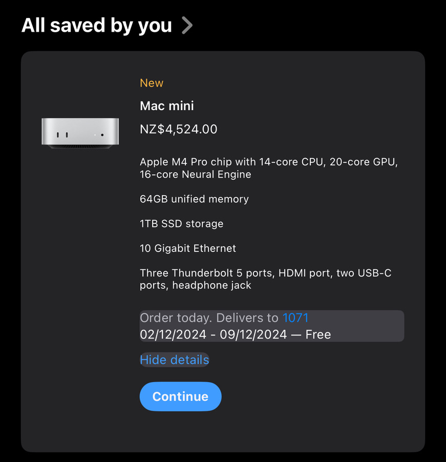

- Merged Managed Identity support into [[Farmside]] [[SMX3]] container
- Merged OX Taxonomy support for [[Farmside]] and [[SMX3]]
- {:height 909, :width 870} - putting in request for new M4 Mac Mini.