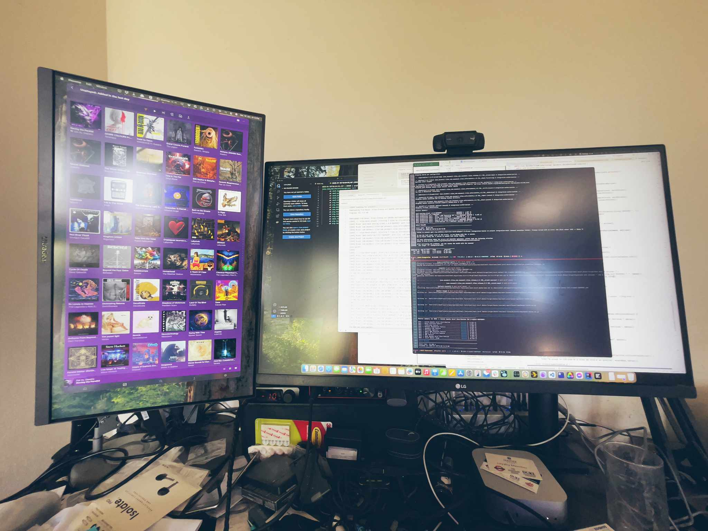

- **16:16** I picked up a VESA mount to set up the 2nd monitor that I got to take to Napier at Christmas, have just screw-mounted it to the desk and mounted the 2nd monitor vertically - almost wish I'd got a higher resolution screen, but for $200 it works fine - and a perfect spot to keep slack etc. off the side. {:height 593, :width 780}
- **17:41** [[SMX3]] Integration Tests for *Shared Services* working, and passing along with various backend changes to resolve the issue, I should however run the test against the unfixed code.
  
  It's interesting to revisit the IT test code base to add new tests. It's somewhat over-engineered and a bit messy (mixing raw TestNG, Concordion, and JBehave tests), but it works.
  
  At one point I wasn't wanting to spend some time and switch things over to using Cucumber JVM/JUnit Jupiter.
	- [What is JBehave?](https://jbehave.org/)
	- [Specification by Example | Concordion](https://concordion.org/index.html)
	- [Cucumber-JVM | Cucumber](https://cucumber.io/docs/installation/java/)
	- [TestNG Documentation](https://testng.org/)
	- [JUnit 5 User Guide](https://junit.org/junit5/docs/current/user-guide/)
- [[Backblaze B2]] backups are costing me roughly $200ish a month currently, of which most of that is backing up the never ended pirate downloads from