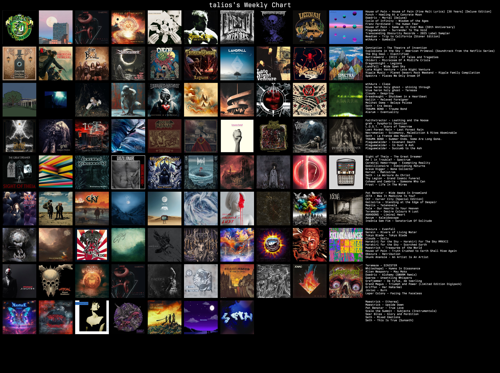

- My Android DAP configuration/apps
	- [NiaGara Launcher](https://play.google.com/store/apps/details?id=bitpit.launcher) - my preferred Android Launcher for my DAPs.
	- [Battery Meter Overlay](https://play.google.com/store/apps/details?id=jp.gr.java_conf.soboku.batterymeter&hl=en_NZ)
- [GitHub - TheBoredTeam/boring.notch: TheBoringNotch: Not so boring notch That Rocks 🎸🎶](https://github.com/TheBoredTeam/boring.notch)
- [Apache Hudi vs Delta Lake vs Apache Iceberg - Data Lakehouse Feature Comparison](https://www.onehouse.ai/blog/apache-hudi-vs-delta-lake-vs-apache-iceberg-lakehouse-feature-comparison) #datalake #bigdata
- **11:31** I'm loving the Lucent Globe cleaning products, and now they've added floor/general cleaning as well:
	- [Surface Cleaning Bundle&ndash; Lucent Globe](https://lucentglobe.com/products/surfaces-bundle)
- **13:42** Caught up with [[Paul Spain]] of [[Gorilla Technology]] for lunch and ice creams, along with his son Pablo. Good chats.
- [Git Trailers | Alchemists](https://alchemists.io/articles/git_trailers)
	- [Milestoner | Alchemists](https://alchemists.io/projects/milestoner)
	- [GitHub - chmln/sd: Intuitive find &amp; replace CLI (sed alternative)](https://github.com/chmln/sd)
- [Improving jj-gcp with  JSON  Schema and schemars](https://v5.chriskrycho.com/notes/improving-jj-gcp-with-json-schema-and-schemars/) #Jujutsu
- {{video https://www.youtube.com/watch?v=Ca1ZwkWUo-o}}
- **19:36** Just got [[OpenZFS]] For Mac finally working on the new MacMini after following the simple guide at {{video https://www.youtube.com/watch?v=o6O5UYODFrY}} on enabling the System Extensions.
- **22:39** First weeks back-to-work listening - so classic House of Pain hip-hop and Pat Benatar, new prog/aor with Landfall, a missed Frost* release from last year, epic new funeral doom from Clouds, pop metal from The Big Deal, the return of Skunk Anansie and Franz Ferdinand.
  