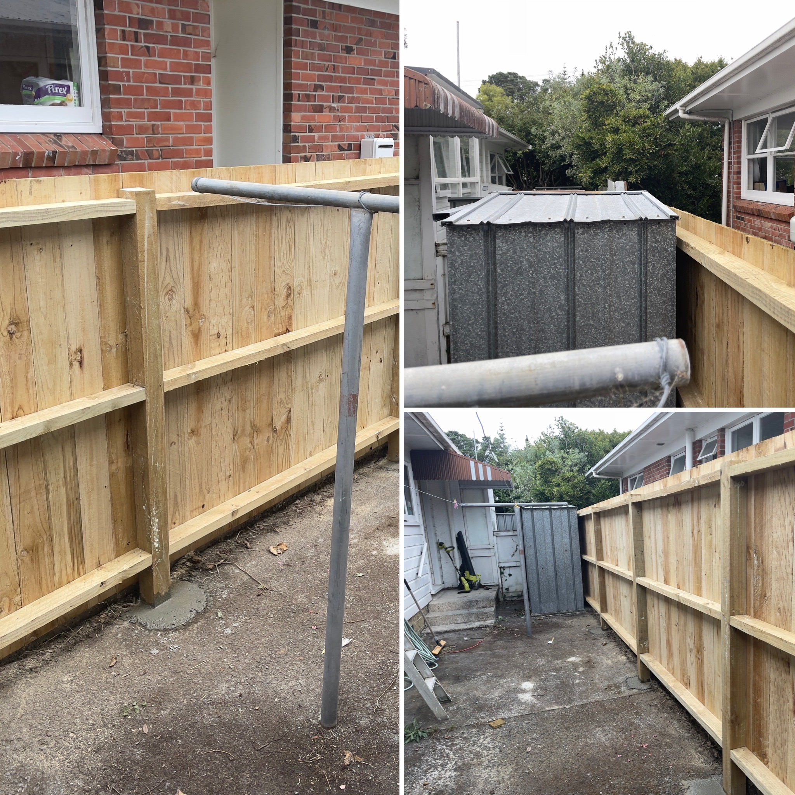

- [Typst 0.13 is out now – Typst Blog](https://typst.app/blog/2025/typst-0.13/)
- [Subtrace](https://subtrace.dev/) - Wireshark for Docker containers
- Came from an all day SMX3/SMX all hands to find a finished new fence:
  
- [Greg Kroah-Hartman Makes A Compelling Case For New Linux Kernel Drivers To Be Written In Rust - Phoronix](http s://www.phoronix.com/news/Greg-KH-On-New-Rust-Code) #linux #rust
- [IntelliJ IDEA 2025.1 EAP 5: More LLMs in JetBrains AI Assistant, Improved Gutter for VCS, and More | The IntelliJ IDEA Blog](https://blog.jetbrains.com/idea/2025/02/intellij-idea-2025-1-eap-5/)
- {{video https://www.youtube.com/watch?v=TBAf5l1RmcA}}
- [jOOQ 3.20 released with ClickHouse, Databricks, and much more DuckDB support, new modules, Oracle type hierarchies, more spatial support, decfloat and synonym support, hidden columns, Scala 3, Kotlin 2, and much more &#8211; Java, SQL and jOOQ.](https://blog.jooq.org/jooq-3-20-released-with-clickhouse-databricks-and-much-more-duckdb-support-new-modules-oracle-type-hierarchies-more-spatial-support-decfloat-and-synonym-support-hidden-columns-scala-3-kotlin/) #java #sql