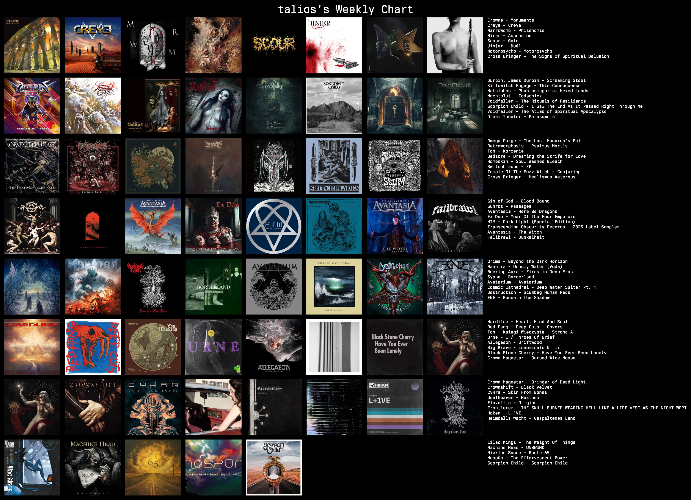

- [Release fish 4.0.0 (released February 27, 2025) · fish-shell/fish-shell · GitHub](https://github.com/fish-shell/fish-shell/releases/tag/4.0.0)
- [HashiCorp officially joins the IBM family](https://www.hashicorp.com/en/blog/hashicorp-officially-joins-the-ibm-family)
- Last weeks listening.
  
- https://www.reddit.com/r/Calibre/comments/1izilbt/psa_all_kindles_jailbreakable/?share_id=vX_R_x27D0Dj5Is6gNuOr&utm_content=2&utm_medium=ios_app&utm_name=iossmf&utm_source=share&utm_term=22 #kindle
- [Using Zig As Cross Platform C Toolchain](https://ruoyusun.com/2022/02/27/zig-cc.html)