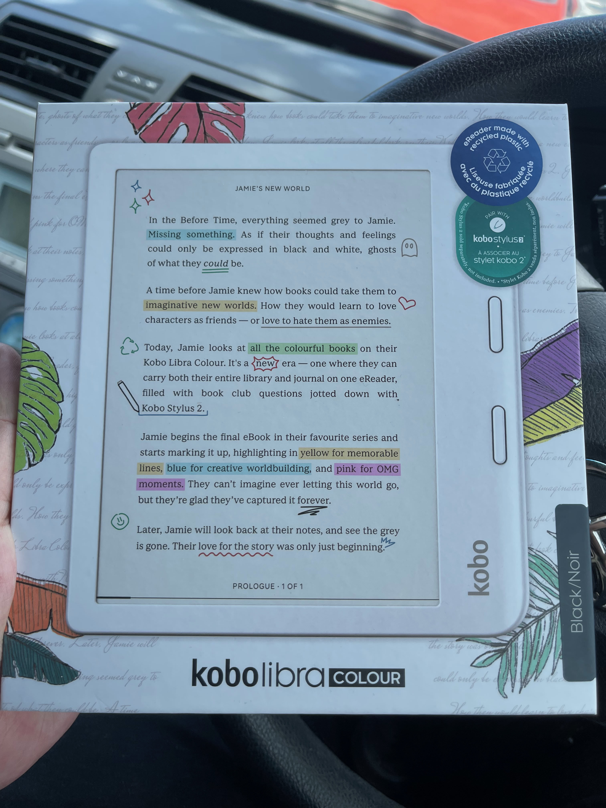

- Approved for Jinger #gig on Monday for [[Red Raven News]]
- Applied firmware update for Fuji XH2
- Deduplicated Calibre Library
	- TODO Rename Asimov's Science Fiction publications by date
		- TODO Subscribe directly to Asimov - https://www.asimovs.com/product/asimovs-fiction-digital-subscription/
	- TODO Rename Analog Science Fiction and Fact publications by date
		- TODO Subscribe directly to Analaog - https://www.analogsf.com/product/analog-science-fiction-and-fact-digital-subscription/
- Purchased new Kobo Colour
  
  
- As with Kindle - seems the Kobo doesn't automatically mount into Finder/OS