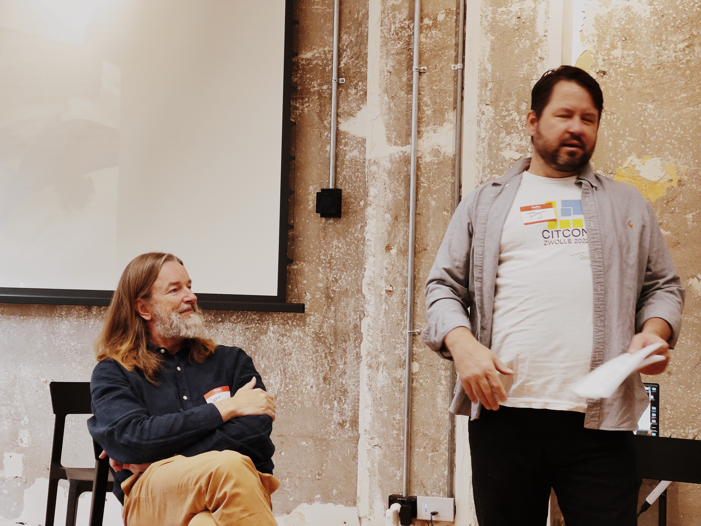

# CITCON ANZ 2025
	- 
	- ## Personal Improvement
		- https://www.kobo.com/nz/en/ebook/the-happiness-project-tenth-anniversary-edition
		- https://www.kobo.com/nz/en/ebook/better-than-before-4
			- Rebel vs Upholder bs Obliger vs People Pleaser etc
			- Marathoners vs Sprinters
		- OmniFocus / LogSeq / Obsidian
		- Streaks focus on the wrong thing - you end up gaming the metrics
		- "habits are a means not a solution"
		- Systems are open ended, goals are closed
	- Power is given, influence is earnt
	- ## Raising/Lowering the Bar
		- Brian Marricks podcast - oddly influenced
		- Turn the ship around - you tube video?
		- Four forgotten agile values...
		- Jurgen Appello - management 3.0
		- https://archive.org/details/philip-b.-crosby-quality-is-free-signet-1980
		- Crossing the chasm -
-