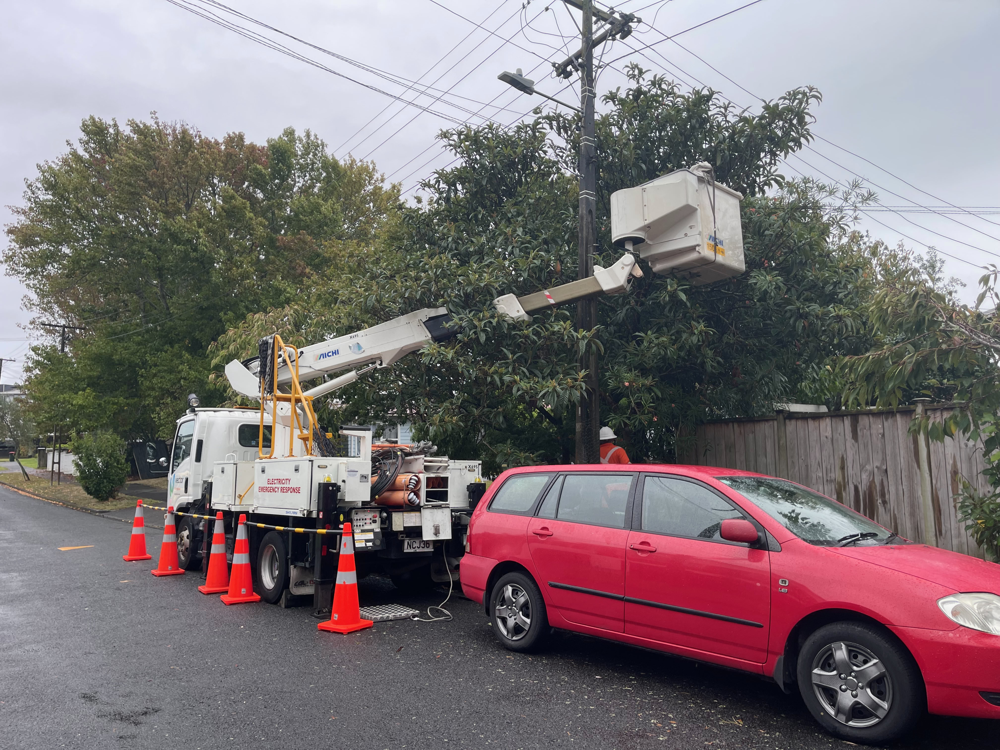
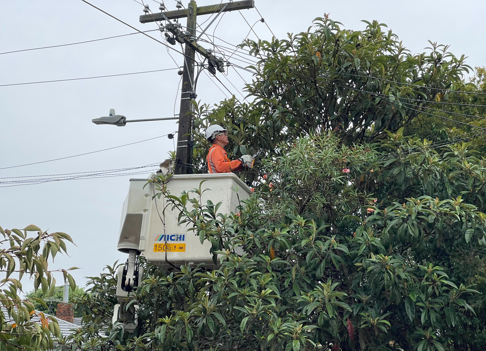
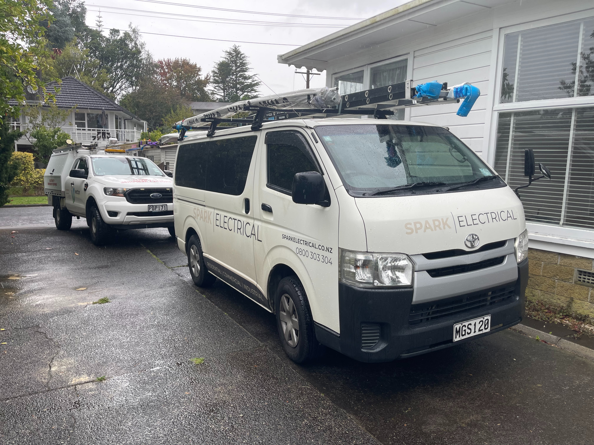

- No snapshots - trunkver? Artifict release to a snapshot repo
- Featureset to dynamically update filters for.
- [Release v0.28.0 · jj-vcs/jj · GitHub](https://github.com/jj-vcs/jj/releases/tag/v0.28.0)
  Power Restored:
  
  
  
- [A Year of Rust in ClickHouse](https://clickhouse.com/blog/rust)
- [Automated deployments: how we made deploying often easy](https://www.channable.com/tech/automated-deployments)
- [Nix that looks like Bazel | Farid Zakaria’s Blog](https://fzakaria.com/2025/04/02/nix-that-looks-like-bazel)
- Power finally restored:
  
-