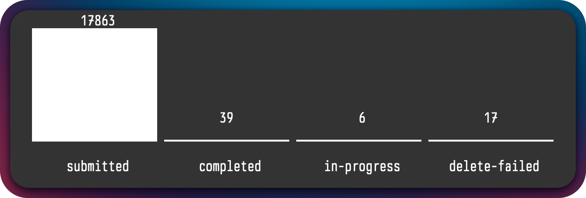

- [GitHub - sgreben/jp: dead simple terminal plots from JSON data. single binary, no dependencies. linux, osx, windows.](https://github.com/sgreben/jp)
	- `curl -sn https://disaster-manager-app.sp1.smxemail.com/reports/summary | jq -r '. | to_entries' | jp -type bar -x ..key -y ..value -height 10 -width 80`
	- 
- {{video https://www.youtube.com/watch?v=jC1icupHlMs}}
- IMPERIAL TRIUMPHANT!
- 
-