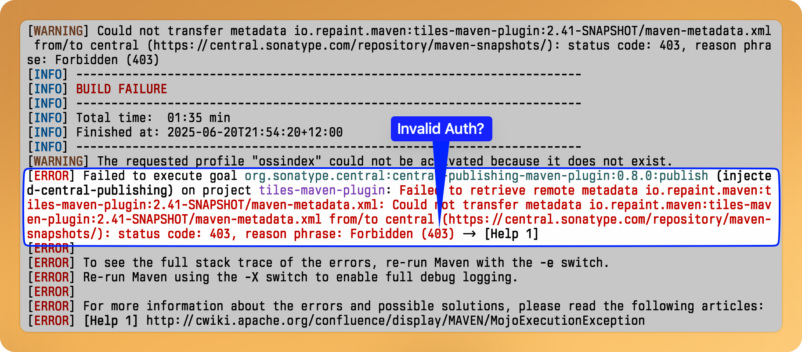

- [Rewriting Kafka in Rust Async: Insights and Lessons Learned in Rust | Rex Wang](https://wangjunfei.com/2025/06/18/Rewriting-Kafka-in-Rust-Async-Insights-and-Lessons-Learned/)
- [Testing a Fresh Look for JetBrains IDEs | The JetBrains Platform Blog](https://blog.jetbrains.com/platform/2025/06/testing-a-fresh-look-for-jetbrains-ides/)
- [Virtual Threads With Java 24 - Will it Scale? | Java &amp;&amp; More](https://gaetanopiazzolla.github.io/java/2025/06/18/virtualthreads-java24.html)
- [Jakarta EE Platform 11 | Jakarta EE | The Eclipse Foundation](https://jakarta.ee/specifications/platform/11/)
- [Moving on from Nix](https://carlosbecker.com/posts/bye-nix/)
- Merged [[Maven]] Tiles PR fixing IntelliJ integration
	- Updated tiles to use new `central.sonatype.com` deployment process, tho currently having authentication/authorisation issues.
	  
- [ApproveJ](https://approvej.org)