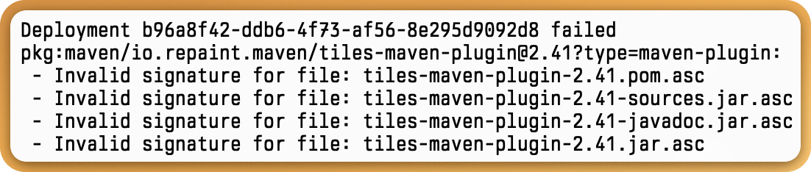

- Pool with [[Matthew Yockney]], [[Jason Wohnseidler]] and [[Bruce Arthur]] #people
- Progress with deployment of tiles
	- Central requires Javadoc, which we'd removed sometime ago when updating things. Groovydoc ([[Richard Vowles]] plugin) doesn't appear to work with "Apache" Groovy and hasn't been updated in some time.
	- Now have signature issues:
	  
	- Turns out publishing your recently created GPG key is helpful for other systems to *actually* be able to sign them.
- [Designing a Better String Utility - Part 2 - DEV Community](https://dev.to/fluentfuture/designing-a-better-string-utility-4k49)
- [Simplicity and power of UUID v7 - Alan Williamson](https://alan.is/2025/06/09/simplicity-and-power-of-uuid-v7/)
-