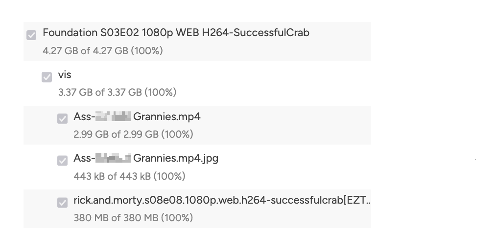

- [OpenZFS Bug Ported to Zig - Andrew Kelley](https://andrewkelley.me/post/openzfs-bug-ported-zig.html)
	- [OpenZFS Bug Ported to C](https://flak.tedunangst.com/post/OpenZFS-Bug-Ported-to-C)
- [JDK 24.0.2, 21.0.8, 17.0.16, 11.0.28, and 8u461 Have Been Released](https://blogs.oracle.com/java/post/jdk-2402-2108-17016-11028-and-8u461-have-been-released)
- [Death by a thousand slops | daniel.haxx.se](https://daniel.haxx.se/blog/2025/07/14/death-by-a-thousand-slops/)
- [Crossplane Is the Cloud-Native Framework for Platform Engineering](https://www.crossplane.io/)
- [[SMX]]
	- Mini 360s
		- DONE Cedrec Rosas
		- TODO Wayne
		- TODO Collin
		- TODO [[Greg Amer]]
	- [[Releases]]
		- Merged / [[Releases]] Jonathan's [[Health]] check changes
			- `com.smxemail.email`
			- `com.smxemail.ldap`
			- `com.smxemail.hibernate`
			- `smx3.mailproducts`
			- `smx3.quarantine`
- When [[Sonarr]] goes wrong.
  
-