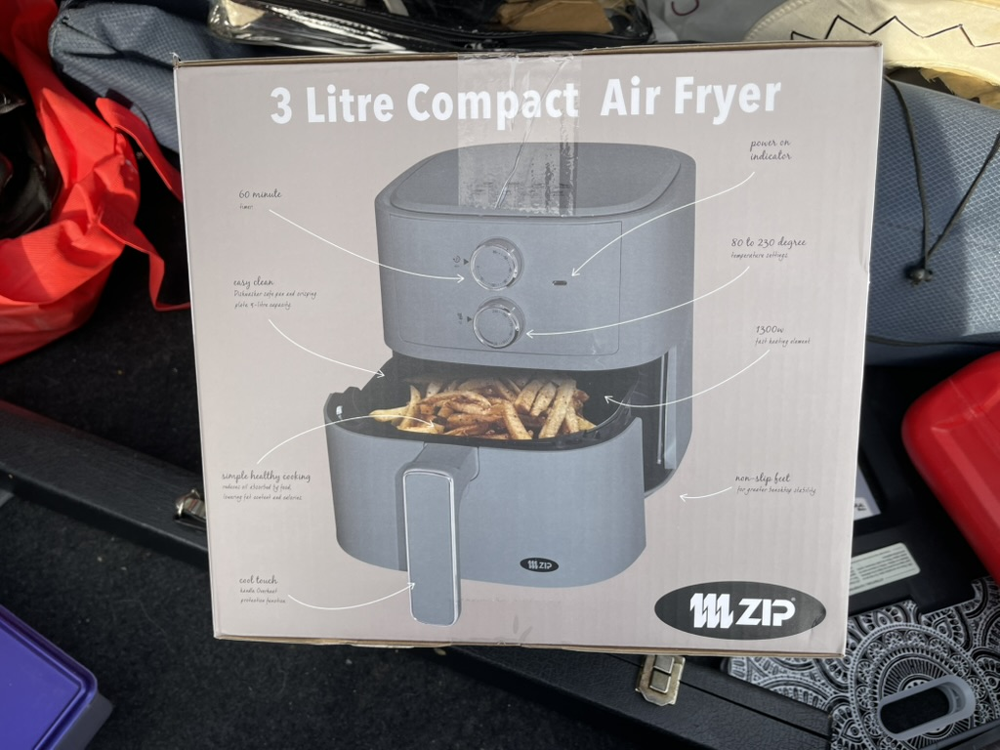

- [GitHub - hewigovens/jayjay: A native macOS GUI for Jujutsu (jj) — DAG graph, side-by-side diffs, interdiff, conflict resolution. Built with Rust + SwiftUI. · GitHub](https://github.com/hewigovens/jayjay)
- Picked up an Air Fryer on special:
  
- [Radicle 1.9.1](https://radicle.dev/2026/05/22/radicle-1.9.1)
-